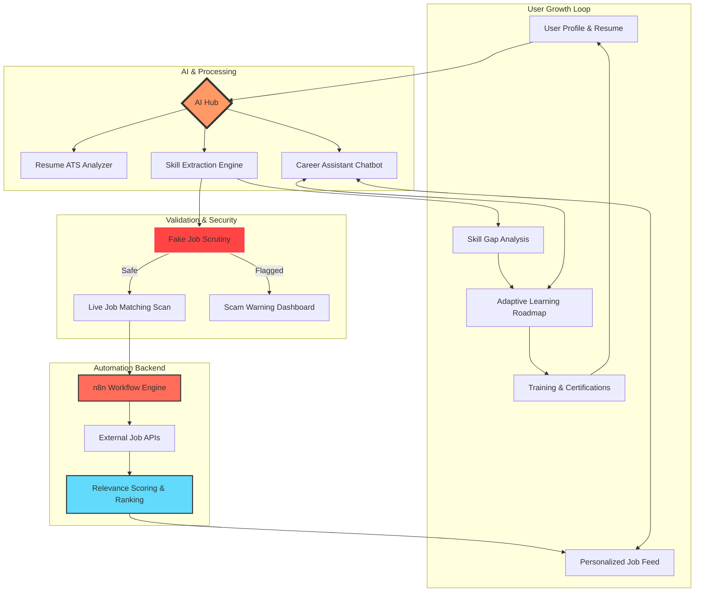

# 🚀 CareerFlow AI – Intelligent Career Navigation & Job Matching

**CareerFlow AI** is a cutting-edge, professional-grade platform designed to revolutionize the way job seekers navigate their career paths. By leveraging Advanced AI models, Automated Workflows (n8n), and Real-time Data Analytics, the platform provides a seamless bridge between a user's current skills and their dream job.


---

## 🌟 Unique Value Proposition

Traditional job portals only search. **CareerFlow AI** _analyzes, trains, and matches_. It doesn't just show you jobs; it detects your skill gaps, suggests roadmaps, protects you from scams, and uses AI to refine your professional brand.

---

## ✨ Integrated Feature Ecosystem

### 🧠 AI-Powered Core

- **AI Career Chatbot**: A 24/7 intelligent career assistant using LLMs (Groq/Gemini) to provide interview tips, career advice, and resume feedback.
- **Resume ATS Analyzer**: High-precision parsing of resume text to calculate ATS compatibility scores and provide actionable optimization tips.
- **Smart Job Matching**: Automated skill extraction that matches your profile against live job boards with ranked scoring.

### 🛡️ Security & Integrity

- **Fake Job Detection**: A sophisticated ML module that analyzes company metadata, URL patterns, and job descriptions to flag potential scams and phishing attempts.

### 📈 Career Development

- **Adaptive Roadmaps**: Dynamic learning paths that evolve based on your chosen role and detected skill gaps.
- **Comprehensive Assessment Suite**: Includes Technical Skill Tests, Aptitude Evaluation, Communication Assessments, and HR Mock Rounds.
- **Role-Based Resume Builder**: A specialized tool to craft resumes tailored to specific industry roles (SDE, Data Science, Product Management, etc.).

### 🌍 Accessibility & Government Integration

- **Opportunity Accessibility**: Advanced filtering tailored for **Tamil Nadu** (38 districts) and integrated **Government Schemes** tracking for student subsidies and grants.

---

## 🗺️ Unique System Architecture (Flowchart)

The following diagram illustrates the intelligent flow of data from User Input to Career Success:



---

## 🛠 The A to Z Tech Stack & Tools

This project utilizes a comprehensive suite of modern tools and libraries to provide a premium AI-driven experience.

### 🅰️ Frontend & Styling

- **Framer Motion**: Powering smooth, high-fidelity animations and transitions.
- **Lucide React**: Providing a consistent and modern set of vector icons.
- **React 19**: Utilizing the latest concurrent rendering features for a snappier UI.
- **React Router Dom**: Managing sophisticated client-side navigation.
- **Recharts**: Crafting interactive and responsive data visualizations for career growth.
- **Tailwind CSS**: A utility-first CSS framework for rapid and maintainable styling.
- **TypeScript**: Ensuring enterprise-grade type safety and developer productivity.
- **Vite 6**: The next-generation frontend tool for lightning-fast hmr and builds.

### 🅱️ AI & Processing Hub

- **Groq Cloud**: Providing the world's fastest inference for our AI Career Chatbot.
- **Google Gemini (GenAI)**: Leveraging advanced LLMs for deep resume analysis and roadmap generation.
- **jsPDF**: Enabling on-the-fly PDF generation for the Role-Based Resume Builder.
- **pdfjs-dist**: High-performance PDF parsing to extract text from user-uploaded resumes.

### 🅲️ Backend, ML & Automation

- **Arbeitnow API**: Real-time integration for global job market data.
- **Docker**: Containerization for consistent deployment of the n8n engine.
- **FastAPI**: A high-performance Python framework for our Machine Learning microservices.
- **n8n**: The low-code heart of our automation, connecting user data to live job streams.
- **Pandas & Scikit-learn**: The backbone of our Fake Job Detection and data analysis models.
- **Uvicorn**: An ASGI web server implementation for Python.

### 🅳️ Development & Productivity

- **Environment Variables (.env)**: Secure management of sensitive API keys and secrets.
- **Git & GitHub**: Industry-standard version control and collaborative workflows.
- **npm**: Robust package management for the extensive JavaScript ecosystem.
- **Postman**: Used for rigorous API testing and webhook validation.

---

## 🚀 Getting Started

### 1. Prerequisites

- Node.js (v18+)
- n8n (Local or Cloud)
- Python 3.9+ (For ML modules)

### 2. Installation

```bash
# Clone the repository
git clone https://github.com/Ashwin-tech-N/AI-Career-Navigation-.git
cd AI-Career-Navigation-

# Install dependencies
npm install
```

### 3. Environment Setup

Create a `.env` file in the root:

```env
VITE_GROQ_API_KEY=your_key_here
VITE_N8N_WEBHOOK_URL=http://localhost:5678/webhook/job-match
```

### 4. Running the Project

```bash
# Start the development server
npm run dev
```

---

## 🛡️ How Fake Job Detection Works

Our system uses a multi-layered approach:

1.  **URL Analysis**: Checks TLDs, keyword spoofing, and domain age.
2.  **Metadata Check**: Verifies company reputations and email domains.
3.  **Pattern Matching**: Detects "Too-Good-To-Be-True" salary offers and suspicious requirements.

---

## 📸 Platform Preview

|                                      Smart Job Matching                                       |                                      Dashboard Analytics                                      |
| :-------------------------------------------------------------------------------------------: | :-------------------------------------------------------------------------------------------: |
|  |  |

---

## 👨‍💻 Author & Contributions

**Maintained by Ashwin**
Full-stack developer | AI Automation Specialist

---

## 📄 License

Distributed under the **MIT License**. See `LICENSE` for more information.
